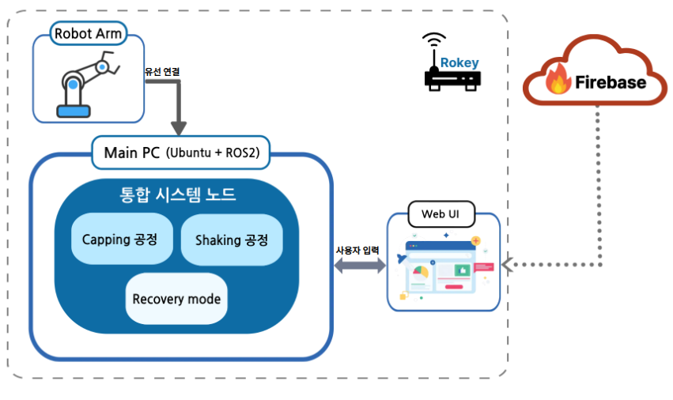
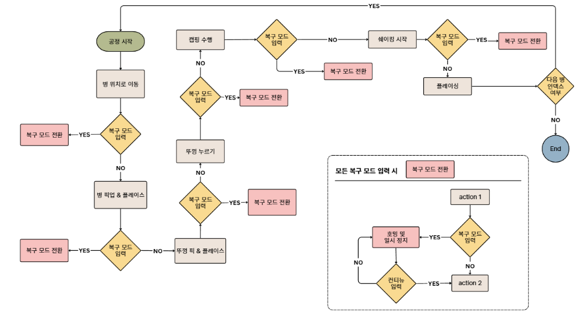

# Cobot Project
두산 로봇 기반 캡핑 및 쉐이킹 자동화 공정 시스템

## 시스템 설계


## 플로우차트


## 운영체제 환경
| 항목 | 내용 |
|------|------|
| OS | Ubuntu 22.04.5 LTS
| ROS2 버전 | humble |
| Python 버전 | 3.10.12 |

## 사용 장비 목록
장비명 : M0609

### 프로젝트 구조
/cobot/src/
├── robot/          # 메인 로봇 제어 패키지
├── capping/        # 캡핑 공정 패키지
├── shaking/        # 쉐이킹 공정 패키지
└── web_ui/         # 웹 UI 및 Firebase 연동 패키지

### ROS2 패키지 의존성

| 패키지 | 의존성 |
|--------|--------|
| `robot` | `rclpy`, `std_msgs`, `sensor_msgs`, `launch`, `launch_ros` |
| `web_ui` | `rclpy`, `std_msgs`, `sensor_msgs`, `dsr_msgs2`, `ros2launch` |
| `capping` | - |
| `shaking` | - |

### Python 외부 패키지

| 패키지 | 용도 |
|--------|------|
| `firebase_admin` | Firebase 실시간 DB 연동 (web_ui) |
| `setuptools` | 패키지 빌드 |
| `pytest` | 테스트 |

### 두산 로봇 관련

| 모듈 | 용도 |
|------|------|
| `DR_init` | 두산 로봇 초기화 모듈 |
| `dsr_msgs2` | 두산 로봇 서비스/메시지 (MoveHome, MoveLine, MoveCircle, GetRobotMode 등) |
| `doosan-robot2` | 두산 로봇 ROS2 드라이버 |

### Python 표준 라이브러리

`time`, `threading`, `math`, `os`, `subprocess`, `glob`

### 설치 방법

```bash
# ROS2 패키지
sudo apt install ros-<distro>-rclpy ros-<distro>-std-msgs ros-<distro>-sensor-msgs

# Python 패키지
pip install firebase-admin pytest

# 두산 로봇 드라이버는 src/doosan-robot2에 포함
```

---

## 사용 설명

### 빌드

```bash
cd ~/cobot
colcon build
source install/setup.bash
```

### 실행

```bash
ros2 run cobot cobot reboot_a_v2
```

---
